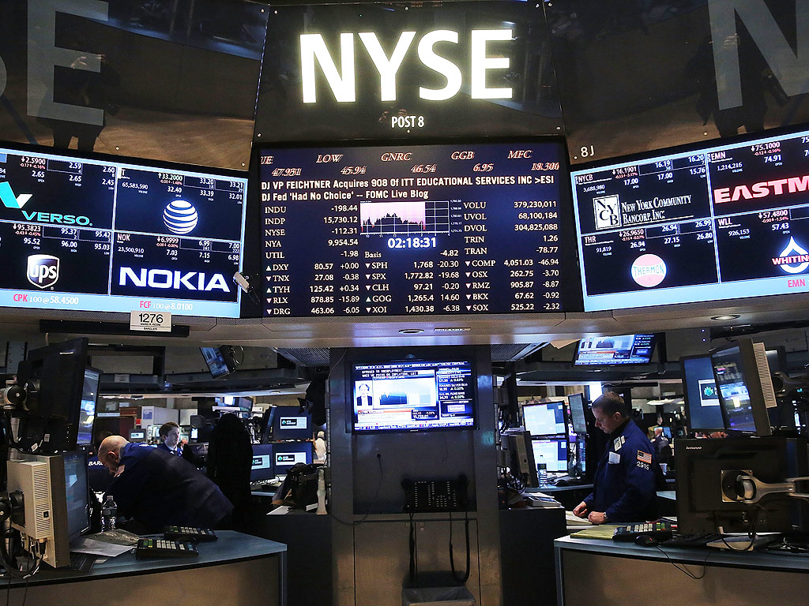
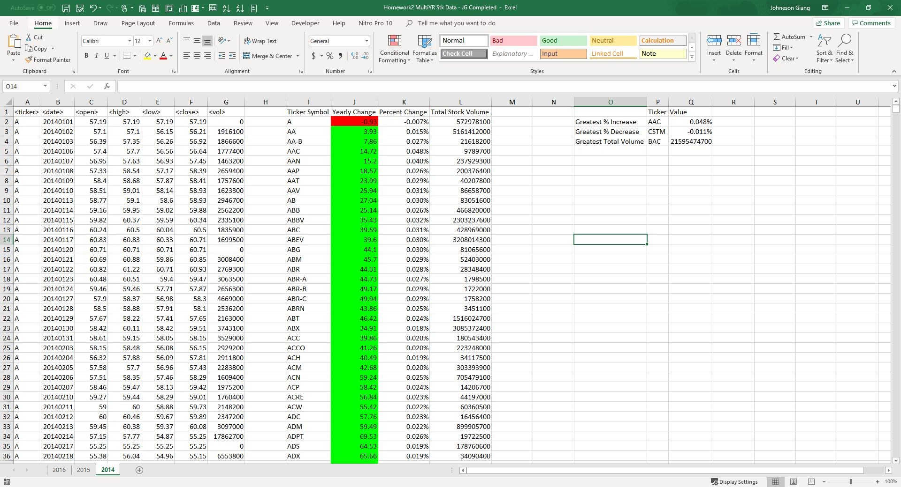
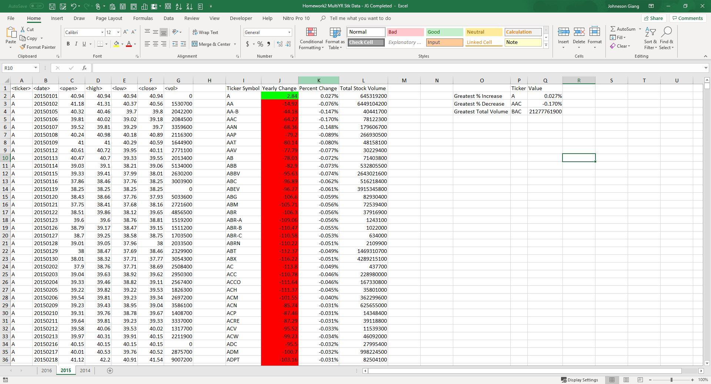
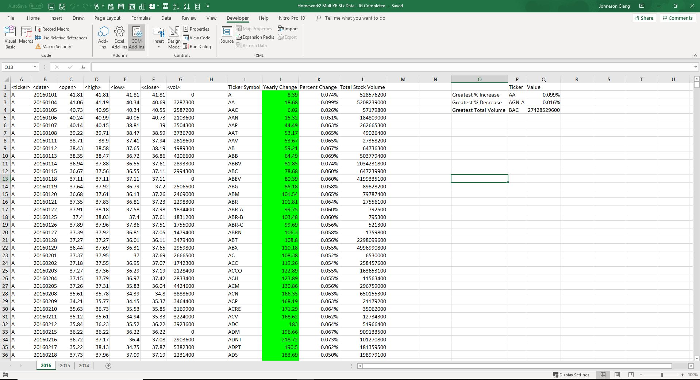

# Wall Street Stock Data Analysis Using VBA

## Project Goal:

 Using my VBA scripting skills to analyze real stock market data over 2014, 2015, 2016 stock data.

## VBA Script Takes The Actions:

* Created a script that loops through each year of stock data and grab the total amount of volume each stock had over the year

* Display the ticker symbol to coincide with the total volume

  * Yearly change from what the stock opened the year at to what the closing price was

  * The percent change from the what it opened the year at to what it closed

  * The total Volume of the stock

  * Ticker symbol

* Conditionally format and highlight positive change in green and negative change in red.

* Locate the stock with the "Greatest % increase", "Greatest % Decrease" and "Greatest total volume".

## Output Results After Implementing VBA Script

## Author

* **Johneson Giang** - *Individual Project* - [Github](https://github.com/jhustles)

## License

This project is licensed under the MIT License - see the [LICENSE.md](LICENSE.md) file for details